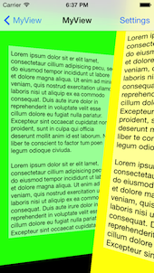
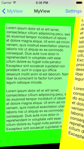
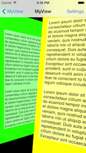
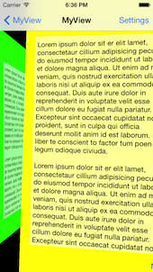

# View Controller Transitions Library

With iOS 7 you can easily create custom view controller transitions that can be used in a range of contexts (push, pop, modal …). This project provides a library of custom animations which can be dropped directly into your project. It also has a number of 'interaction controllers' which can be used with any of the custom animations in order to make your transitions interactive.

The library currently contains the following animations, which can be made interactive with either a swipe or pinch gesture.
 
<table>
<tr>
<th>Flip</th>
<th>Fold</th>
<th>Crossfade</th>
<th>Explode</th>
</tr>
<tr>
<td></td>
<td></td>
<td></td>
<td></td>
</tr>
<tr>
<th>Turn</th>
<th>Cards</th>
<th>NatGeo</th>
<th>Portal</th>
</tr>
<tr>
<td></td>
<td></td>
<td></td>
<td></td>
</tr>
<tr>
<th>Cube</th>
<th>Pan</th>
<th></th>
<th></th>
</tr>
<tr>
<td></td>
<td></td>
<td></td>
<td></td>
</tr>
</table>

## Contents

 * [A brief introduction to custom transitions](#a-brief-introduction-to-custom-transitions)
 * [Adding custom transitions to your project](#adding-custom-transitions-to-your-project)
   * [Grabbing the code](#grabbing-the-code)
   * [Using an animation controller](#using-an-animation-controller)
     * [Custom present / dismiss transitions](#custom-present--dismiss-transitions)
     * [Custom navigation controller transitions](#custom-navigation-controller-transitions)
     * [Custom tab bar controller transitions](#custom-tab-bar-controller-transitions)
   * [Using an interaction controller](#using-an-interaction-controller)
     * [Interactive dismiss transitions](#interactive-dismiss-transitions)
     * [Interactive pop transitions](#interactive-pop-transitions)
     * [Interactive tab transitions](#interactive-tab-transitions)
 * [Transitions library](#transitions-library)


## A brief introduction to custom transitions

The following provides a very brief introduction to the concepts, for more detailed coverage I would thoroughly recommend reading Chapter 3 of [iOS 7 By Tutorials](http://www.raywenderlich.com/store/ios-7-by-tutorials?source=ceberhardt) - which I wrote! (I've heard the other 15 chapters are pretty good too ;-)

There are two key classes involved in a custom transition:

 + **Animation controller** - this class is responsible for performing the custom transitions. When you indicate that a custom transitions should be used, you provide an animation controller. This class performs the required animation, then informs the framework when it has completed.
 + **Interaction controller** - this class is responsible for managing interactive transitions - these are transitions that typically controlled by a gesture, allowing the user to swipe, pinch or perform some other action to navigate between view controllers. Importantly, interaction controllers allow transitions to be cancelled, i.e. a user can start the navigation, change their mind, and reverse it!
 
**NOTE:** Animation and interaction controllers are entirely independent, this means you can wire up any interaction controller with any animation controller - which is pretty awesome.
 
## <a id="intro"></a>Adding custom transitions to your project

This sections gives a brief overview of the steps required to add custom view controller transitions to your project. You might also want to look at the code for the demo app (in the `TransitionsDemo` folder) for reference. If you already know how the iOS 7 custom view controller transitions work, feel free to skip this section!

### <a id="grabbing"></a>Grabbing the code

There are a couple of ways you can incorporate transitions from this library into your code:

 1. **Cocoapods** - simply add a reference to **VCTransitionsLibrary** to your pod file.
 2. **Manual file copy** - if you are not using Cocoapods, you can simply copy the required files into your project. The `AnimationControllers` and `InteractionControllers` folders contain all the code that is required.
 
### <a id="animation"></a>Using an animation controller

The `AnimationControllers` folder contains a number of animate controllers, which provide custom transitions, which can be integrated into your project as follows:

#### <a id="animationPresent"></a>Custom present / dismiss transitions

The `UIViewControllerTransitioningDelegate` protocol is used to supply animation controllers for present / dismiss transitions. When a view controller is presented or dismissed the `transitioningDelegate` property of the view controller being presented or dismissed is used to supply this delegate. Simply return one of the animation controllers in response to the `animationControllerForPresentedController: presentingController: sourceController:` message for presenting, and `animationControllerForDismissedController:` for dismissing.

#### <a id="animationNavigation"></a>Custom navigation controller transitions

The `UINavigationControllerDelegate` protocol has methods that can be used to provide animation controllers. Simply return an animation controller in response to the `navigationController: animationControllerForOperation: fromViewController: toViewController:` message.

Notice that this message has an 'operation' argument that allows you to return different animations for push and pop operations. All of the animation controllers in this library subclass `CEReversibleAnimationController` which allows you to play the animation in reverse. This is commonly used in conjunction with the navigation controller as follows:

```objc
- (id<UIViewControllerAnimatedTransitioning>)navigationController:
                                (UINavigationController *)navigationController
   animationControllerForOperation:(UINavigationControllerOperation)operation
                fromViewController:(UIViewController *)fromVC
                  toViewController:(UIViewController *)toVC {
    
    // reverse the animation for 'pop' transitions
    _animationController.reverse = operation == UINavigationControllerOperationPop;
    
    return _animationController;
}
```

#### <a id="animationTab"></a>Custom tab bar controller transitions

The `UITabBarControllerDelegate` protocol has methods that can be used to provide animation controllers. Simply return an animation controller in response to the `tabBarController: animationControllerForTransitionFromViewController: toViewController:` 
message.

In order to determine the animation direction, you can compare the indices of the two view controller as shown below:

```objc
- (id <UIViewControllerAnimatedTransitioning>)tabBarController:(UITabBarController *)tabBarController
            animationControllerForTransitionFromViewController:(UIViewController *)fromVC
                                              toViewController:(UIViewController *)toVC {
    
    NSUInteger fromVCIndex = [tabBarController.viewControllers indexOfObject:fromVC];
    NSUInteger toVCIndex = [tabBarController.viewControllers indexOfObject:toVC];
    
    _animationController.reverse = fromVCIndex < toVCIndex;
    return _animationController;
}
```


### <a id="interaction"></a>Using an interaction controller

Interaction controllers work in conjunction with an animation controller in order to make a transitions interactive, i.e. allow a user to control a transitions using gestures. This interactivity allows a use to move forwards, backwards and even cancel a transitions.

The interaction controller is responsible for adding gesture recognisers to the view and triggering the navigation in response to gestures from the user.

#### <a id="interactionDismiss"></a>Interactive dismiss transitions

The `UIViewControllerTransitioningDelegate` protocol that is used to supply animation controllers is also used to supply interaction controllers. An example implementation, that uses a swipe interaction together with a flip animation, is show below:

```objc
// instance variables, typically instantiated in your init method
CEFlipAnimationController *_animationController;
CESwipeInteractionController *_interactionController;

- (id<UIViewControllerAnimatedTransitioning>)
      animationControllerForPresentedController:(UIViewController *)presented
                           presentingController:(UIViewController *)presenting
                               sourceController:(UIViewController *)source {
    
    // allow the interaction controller to wire-up its gesture recognisers
    [_interactionController wireToViewController:presented 
                                    forOperation:CEInteractionOperationDismiss];
       _animationController.reverse = NO;
    return _animationController;
}

- (id<UIViewControllerAnimatedTransitioning>)
     animationControllerForDismissedController:(UIViewController *)dismissed {
    _animationController.reverse = YES;
    return _animationController;
}

- (id<UIViewControllerInteractiveTransitioning>)
           interactionControllerForDismissal:
                (id<UIViewControllerAnimatedTransitioning>)animator {
                
    // provide the interaction controller, if an interactive transition is in progress
    return _interactionController.interactionInProgress
                ? _interactionController : nil;
}
```

Note that in the above code the `interactionInProgress` property of the interaction controller is checked. This is because your might want to allow the user to dismiss the view controller using a button as well as via an interaction. Also, you must tell the interaction controller the operation it should perform (i.e. pop, dismiss).

#### <a id="interactionPop"></a>Interactive pop transitions

The `UINavigationControllerDelegate` protocol also has an equivalent method for returning interactions controllers. A typically implementation, which follows the same pattern as above, is shown:

```objc
// instance variables, typically instantiated in your init method
CEFlipAnimationController *_animationController;
CESwipeInteractionController *_interactionController;

- (id<UIViewControllerAnimatedTransitioning>)
                 navigationController:(UINavigationController *)navigationController
      animationControllerForOperation:(UINavigationControllerOperation)operation
                   fromViewController:(UIViewController *)fromVC
                     toViewController:(UIViewController *)toVC {
    
    // wire the interaction controller to the to- view controller
    [_interactionController wireToViewController:toVC
                                    forOperation:CEInteractionOperationPop];
    
    _animationController.reverse = operation == UINavigationControllerOperationPop;
    
    return _animationController.reverse;
}

- (id <UIViewControllerInteractiveTransitioning>)
                         navigationController:(UINavigationController *)navigationController 
  interactionControllerForAnimationController:(id <UIViewControllerAnimatedTransitioning>)animationController {
    
    // provide the interaction controller, if an interactive transition is in progress
    return _interactionController.interactionInProgress
                ? _interactionController : nil;
}
```

#### <a id="interactionPop"></a>Interactive tab transitions

The `UITabBarControllerDelegate` protocol has an equivalent method for returning interactions controllers. As with the navigation controller example above, the interaction controller needs to add its gesture recognisers to the view controllers that the tab bar controller navigates between. Unfortunately the tab bar delegate methods don't get fired when the first view controller is presented, so I opt for a slightly messier implementation using Key-Value observing:

```objc
@implementation TabBarViewController {
    CEFoldAnimationController *_animationController;
    CESwipeInteractionController *_swipeInteractionController;
}

- (id)initWithCoder:(NSCoder *)aDecoder {
    if (self = [super initWithCoder:aDecoder]) {
        self.delegate = self;
        
        // create the interaction / animation controllers
        _swipeInteractionController = [CESwipeInteractionController new];
        _animationController = [CEFoldAnimationController new];
        _animationController.folds = 3;
        
        // observe changes in the currently presented view controller
        [self addObserver:self
               forKeyPath:@"selectedViewController"
                  options:NSKeyValueObservingOptionNew
                  context:nil];
    }
    return self;
}

- (void)observeValueForKeyPath:(NSString *)keyPath ofObject:(id)object
                        change:(NSDictionary *)change
                       context:(void *)context
{
    if ([keyPath isEqualToString:@"selectedViewController"] )
    {
    	// wire the interaction controller to the view controller
        [_swipeInteractionController wireToViewController:self.selectedViewController
                                             forOperation:CEInteractionOperationTab];
    }
}


- (id <UIViewControllerAnimatedTransitioning>)tabBarController:(UITabBarController *)tabBarController
            animationControllerForTransitionFromViewController:(UIViewController *)fromVC
                                              toViewController:(UIViewController *)toVC {
    
    NSUInteger fromVCIndex = [tabBarController.viewControllers indexOfObject:fromVC];
    NSUInteger toVCIndex = [tabBarController.viewControllers indexOfObject:toVC];
    
    _animationController.reverse = fromVCIndex < toVCIndex;
    return _animationController;
}

-(id<UIViewControllerInteractiveTransitioning>)tabBarController:(UITabBarController *)tabBarController interactionControllerForAnimationController:(id<UIViewControllerAnimatedTransitioning>)animationController
{
    return _swipeInteractionController.interactionInProgress ? _swipeInteractionController : nil;
}

@end
```

## <a id="library"></a>Transitions Library

The following is a graphical illustration of the various transitions. All animation controllers have a `duration` property that configures the animation duration.

### Fold animation - CEFoldAnimationController

Animates between the two view controllers using a paper-fold style transition. You can configure the number of folds via the `folds` property.


### Flip animation - CEFlipAnimationController

Animates between the two view controllers using a page-flip transition. 


### NatGeo animation - CENatGeoAnimationController

Animates between the two view controllers using transition inspired by [City Guides by National Geographic](https://itunes.apple.com/us/app/city-guides-by-national-geographic/id592453480?mt=8).
It's an adoptation of [MHNatGeoViewControllerTransition](https://github.com/michaelhenry/MHNatGeoViewControllerTransition/) to iOS7 APIs.






### Turn animation - CETurnAnimationController

Animates between the two view controllers by performing a 3D flip, to reveal the destination view on the back.The turn animation has a `flipDirection` property that specifies the turn orientation.


### Crossfade animation - CECrossfadeAnimationController

Animates between the two view controllers by performing a simple cross-fade. 


### Explode animation - CEExplodeAnimationController

Animates between the two view controllers by slicing the from- view controller into lots of little pieces, then randomly spinning and shrinking them.


### Cards animation - CECardsAnimationController

Gives the impression of one view controller pushing the other to the back. It looks a lot more cool than these static screenshots!

(courtesy of Tope - AppDesignVault)


### Portal animation - CEPortalAnimationController

The top-most view controller parts in the middle to reveal the view controller beneath.

(courtesy of [FreddyF](https://github.com/FredddyF))


### Cube animation - CECubeAnimationController

This transition gives the appearance of rotating the faces of a cube.

(courtesy of [Andrés Brun](https://github.com/andresbrun))


